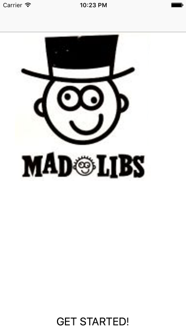

Joël Fleuren

Madlibs
deze app vraag om input van de user als alle input is gegeven wordt de input in de text geplaatst en kan het gelezen worden. Welke text de user moet invoeren is random

The screenshots

